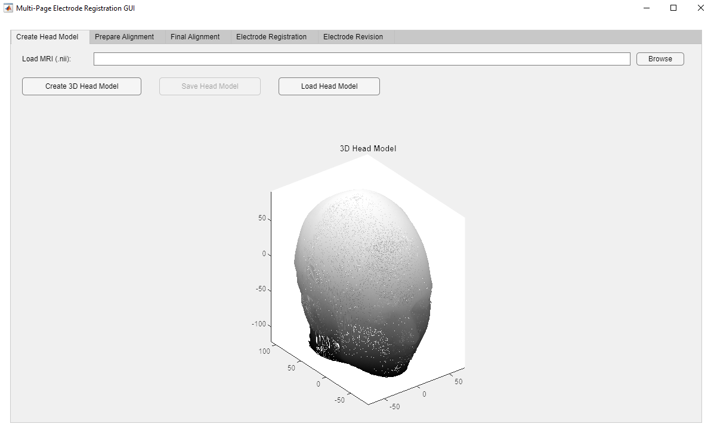
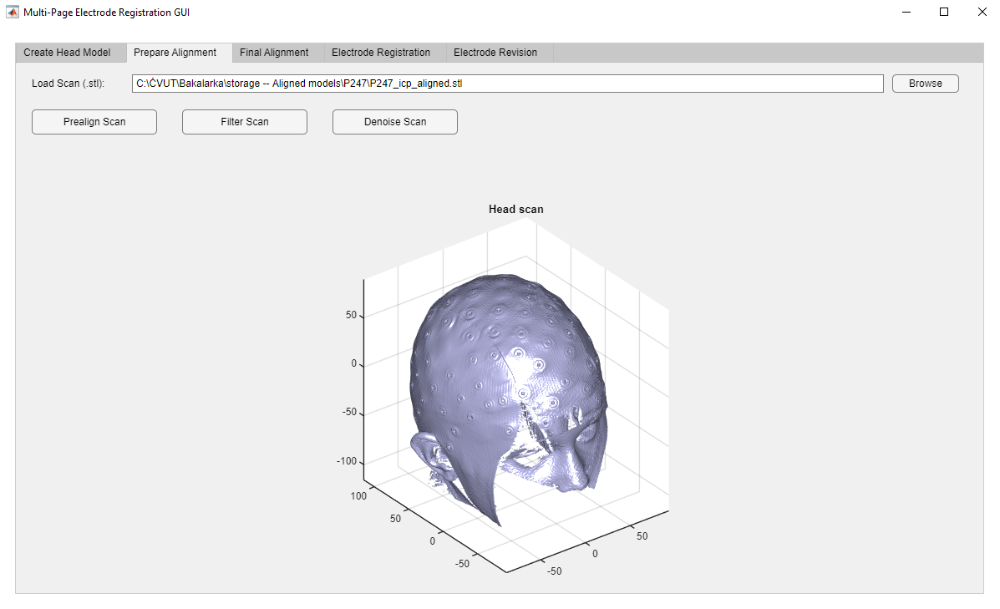
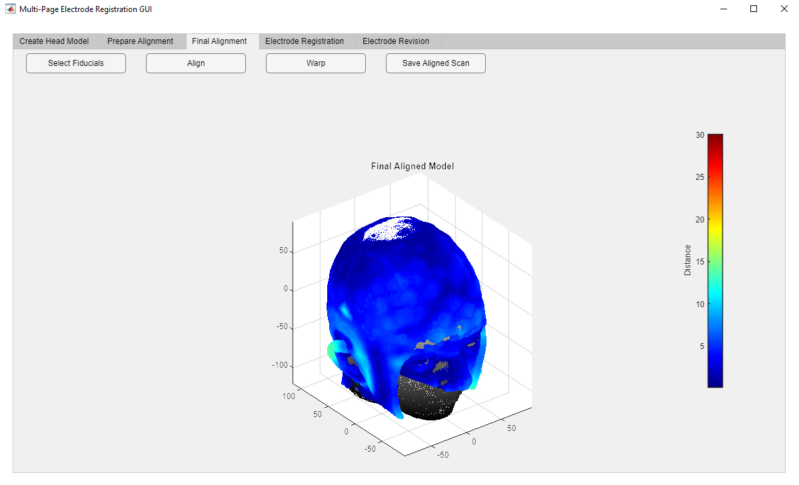
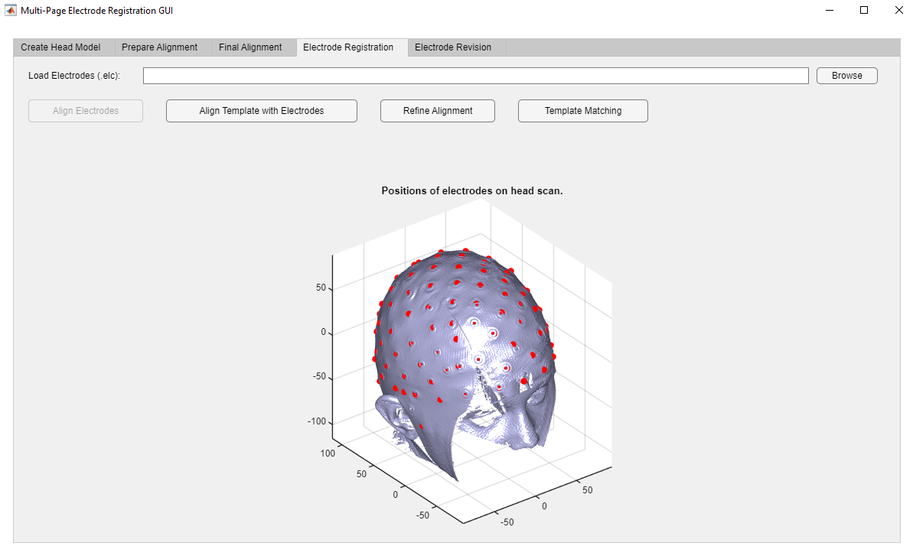
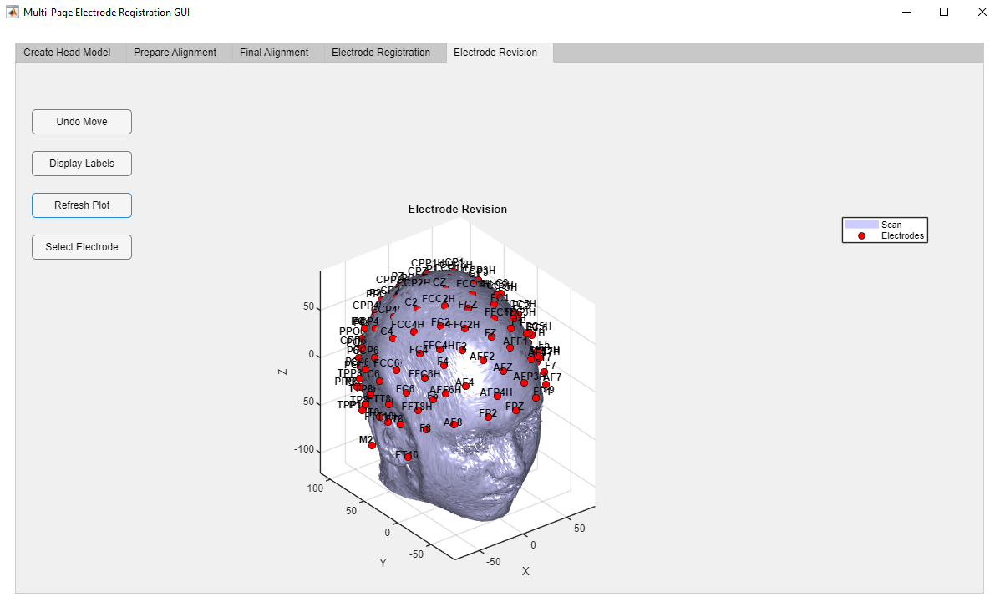

# electrodes_registration

**Implementation of a High-Density EEG Cap Electrodes Registration Pipeline in MATLAB.**

## Table of Contents

- [Introduction](#introduction)
- [Installation](#installation)
- [Usage](#usage)

## Introduction

This project provides a MATLAB-based implementation of a pipeline for registering electrodes from a high-density electroencephalography (hdEEG) cap onto a subject's scalp model. Acurate electrode registration is crucial for source localization and neuroimaging analyses in neuroscience research.
 
## Installation

1. **Clone the Repository**

   ```bash
   git clone https://github.com/cernito/electrodes_registration.git
   ```
   
2. **Add to MATLAB Path**

   Open MATLAB and add the cloned directory to your path.

3. **Install Dependencies**

   Ensure that all required MATLAB toolboxes are installed

## Usage

1. **Prepare Your Data**

- Ensure you have your MRI scans, HD-EEG cap and electrode data ready.
- Supported formats:
  - MRI scan: `.nii`
  - 3D scan: `.stl`
  - Electrode data: `.elc`, `.fcsv`
 
2. **Run the Main Script**

   Run GUI interface with script
   ```matlab
   main_gui
   ```

2. **Follow the Pipeline**

   **Page 1**  
   Firstly you will be prompted to import a MRI scan.
   The creation of the 3D head model might take a little longer (a minute) to finish.
   After completion user is prompted to save the created file.

   

   **Page 2**  
   Next you will be guided by the program to import a 3D head scan and interact with the process.
   User will be prompted to pre-align and filter the obtained 3D scan.

   

   **Page 3**  
   After completed pre-alignment user can perform the final alignment of the head scan with the MRI head model.
   The final aligned head_scan can be saved by the user.

   

   **Page 4**  
   On the next tab the user will be prompted to import a `.elc` file with the electrode positions.
   Here the user pre-aligns the electrodes and performs the electrode registration.

   

   **Page 5**
   The result of the electrode detection/registration can be viewed in a seperate revision tab.

   


